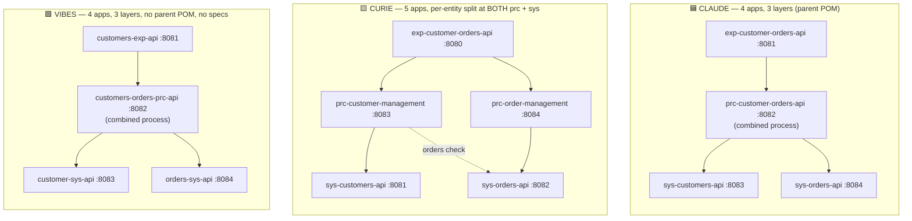

# AI Showdown: Claude Code vs. CurieTech vs. MuleSoft Vibes

A side-by-side evaluation of three AI-generated MuleSoft **API-led connectivity** solutions built from the same prompt ([`instructions-given.md`](instructions-given.md)): a Customers + Orders domain across the Experience / Process / System layers, 11 CRUD operations, mock/seed data in the system layer, at least 3 APIs, and the "latest" Mule / Maven / DataWeave.

- 🟦 **Claude** — `claude/` (Claude Code, Opus 4.8)
- 🟨 **CurieTech** — `curie/`
- 🟩 **MuleSoft Vibes** — `vibes/`

> **Version note:** Version findings below were verified directly against `docs.mulesoft.com` release-notes pages. All version numbers each AI used are real, released versions.

---

## Scorecard

| Dimension | 🟦 Claude (Opus 4.8) | 🟨 CurieTech | 🟩 MuleSoft Vibes |
|---|---|---|---|
| **# Apps** | 4 (1 exp · 1 prc · 2 sys) | **5** (1 exp · 2 prc · 2 sys) | 4 (1 exp · 1 prc · 2 sys) |
| **All 3 layers?** | ✅ Yes | ✅ Yes | ✅ Yes |
| **Parent/aggregator POM** | ✅ Yes (reactor) | ❌ No (standalone) | ❌ No (standalone) |
| **Contract-first (RAML)?** | ✅ RAML 1.0, all apps | ✅ RAML 1.0, all apps | ❌ **No specs at all** |
| **APIkit** | ✅ | ✅ | ❌ hand-rolled HTTP listeners |
| **11 ops in the spec** | ✅ 11/11 | ✅ 11/11 (spread across apps) | ➖ n/a (no spec) |
| **11 ops implemented** | ✅ 11/11 functional | ✅ 11/11 functional | ⚠️ 11/11 coded, but **writes don't persist** |
| **Security** | ❌ None | ❌ None | ❌ None |
| **Error handling — spec** | ✅ 400/404/409/(500 trait) | ✅ 400/404/409 | ❌ None |
| **Error handling — code** | ✅ Global handlers, all apps | ✅ Global handlers + 502 gateway | ❌ **No global handler** |
| **Mock/seed in system layer** | ✅ File-backed JSON (persists) | ⚠️ **ObjectStore connector** (persists in-mem) | ✅ Read-only JSON (no persist) |
| **Added DB/OS connector?** | File connector | **ObjectStore connector** | None |
| **MUnit tests** | ✅ 18 cases | ✅ **41 cases** | ❌ **Zero** |
| **Docs/rationale** | ✅ Plan + READMEs | ✅ READMEs (per app) | ❌ **None** |
| **Runtime version** | 4.9.0 (real, oldest) | 4.11.3 (4 apps) + 4.9.3 (1 app) | 4.11.2 (all) |
| **Version consistency** | ✅ centralized | ❌ drift across apps | ✅ consistent |

**One-line each:** Claude = the most disciplined build (contract-first, documented, parent-POM, tested, all ops work *and survive restarts*) on a single, older runtime. CurieTech = the most complete and granular topology (full 5-app per-entity split, all ops functional, most tests, best error handling) held back by version drift and no central POM. Vibes = fastest-looking demo that runs, but skips the MuleSoft engineering rigor (no specs, no tests, no error handler, writes don't persist).

---

## 1. Architecture pattern differences

- **Claude & Vibes converged on the same shape:** 1 experience + **1 combined** process + **2 per-entity** system APIs. Both treat the customer as the aggregate root with orders as a sub-resource (`/customers/{id}/orders/...`). The difference is Claude *documented why* and wired a **parent reactor POM** to enforce build order; Vibes did neither.
- **Curie went the most granular — a true microservice split.** It separated the process layer **per entity** (customer-management + order-management) *and* the system layer per entity (sys-customers + sys-orders) → a **5-app** design. Each process API owns its own domain and calls the matching system API; the customer-management API also reaches into the orders system API for the "delete only if no orders" cross-entity rule. This is the most faithful "one API per concern" reading of API-led connectivity, at the cost of more moving parts and cross-app calls.
- **Parent POM:** only Claude has one. Curie and Vibes are loose standalone projects — which is exactly why Curie drifts on versions (see §6).

### Documented rationale for app count

- **Claude (strongest):** `original-claude-plan.md` + README explicitly argue *"One Process API, not two… Customer is the natural aggregate root with orders as a sub-resource… System APIs split per entity… one System API per system-of-record… No 'one big API' and no over-splitting."* It consciously chose 4 and explained the trade-off.
- **Curie (documented per app):** each app ships its own README describing the full 5-app call chain and ports (exp :8080 → prc-customer :8083 / prc-order :8084 → sys-customers :8081 / sys-orders :8082). The sys-orders README even notes the seed intentionally leaves one customer (CUST-005) with **no orders** so the "delete only if no orders" rule can be demonstrated. What's missing is a *single* top-level rationale doc tying the five together and justifying the per-entity process split.
- **Vibes (none):** no README, no design doc, no comments explaining the count. The `vibes/services` folder is empty. You'd only know the topology by reading the flows.

---

## 2. API specification differences

### Resources & methods

| App | Claude | Curie | Vibes |
|---|---|---|---|
| **Experience** | 5 resources / **11 methods** | ~5 resources / **11 methods** | *(no spec)* 11 endpoints via HTTP listeners |
| **Process** | 5 resources / **11 methods** (1 combined) | customer: 2 res / 5 methods · order: 3 res / 6 methods (**2 APIs**) | *(no spec)* |
| **System** | customers 2/5 + orders 2/5 | customers 2 res / 5 methods · orders **3 res / 6 methods** | *(no spec)* |
| **Spec format** | RAML 1.0 | RAML 1.0 | **None — not contract-first** |

The headline here: **Vibes has no API specification at all.** No RAML, no OpenAPI. It hand-rolls routing with raw `<http:listener>` components and manual path/method matching — no APIkit. For a "MuleSoft API-led connectivity" exercise, that's the biggest architectural miss of the three, because the "contract" is the whole point of the pattern.

**Curie's orders system API** is the most granular spec of the set: `/orders` (GET with `?customerId` filter + POST), `/orders/{orderId}` (GET/PUT/DELETE), and a dedicated **`PATCH /orders/{orderId}/status`** for status transitions — a clean separation of "edit the order" from "change its status." Typed `Order`/`OrderItem`/`StatusUpdate`/`Error` data types with a `NEW/CONFIRMED/SHIPPED/CANCELLED` status enum.

### Request/Response modeling

- **Claude — strictest:** distinct input vs output types (`NewCustomer` vs `Customer`, `NewOrder` vs `Order`), plus a dedicated `CustomerWithOrders` aggregate type for the experience layer's single-screen call. Committed JSON **examples** in the system layer.
- **Curie — typed but permissive:** proper request/response types and a status enum, but the higher-layer types declare `additionalProperties: true` (passthrough-friendly). Few/no inline examples in the RAML.
- **Vibes — none:** untyped JSON passthrough end-to-end, no schema validation anywhere.

### Security

**All three added zero security.** No `securitySchemes`, no client-id/secret enforcement, no OAuth, no Basic auth, no API Manager policy hooks, no auth traits. Open listeners on all layers. This is a uniform gap — worth calling out since a "think like an architect" prompt would ideally have produced at least client-id enforcement on the experience API.

### Error handling **in the spec**

- **Claude:** declares `400 / 404 / 409 / 204` per method with a reusable `Error` data type; even defines a `hasServerError` (500) **trait** — though the trait is declared but never actually applied to endpoints.
- **Curie:** declares `404` (and `400`/`409` where relevant) with `Error`/`ErrorResponse` types; `500` is handled in code rather than declared in RAML. The 409 for the delete-guard and cancel-conflict is documented at the process layer.
- **Vibes:** nothing declarative — no spec to declare it in.

---

## 3. Do all 11 operations exist — in spec AND implementation?

The operations from the prompt (lines 6–16):

| # | Operation | Claude | Curie | Vibes |
|---|---|---|---|---|
| 1 | List all customers | ✅ | ✅ | ✅ |
| 2 | One customer's details | ✅ | ✅ | ✅ |
| 3 | Get a customer's orders | ✅ | ✅ | ✅ but read-only |
| 4 | One order's details | ✅ | ✅ | ✅ but read-only |
| 5 | Create customer | ✅ | ✅ | ⚠️ returns 201, **not persisted** |
| 6 | Edit customer | ✅ | ✅ | ⚠️ returns 200, **not persisted** |
| 7 | Delete customer only if no orders | ✅ (409 guard) | ✅ (409 guard, queries orders sys) | ✅ (409 guard, but read-only data) |
| 8 | Create order for a customer | ✅ | ✅ | ⚠️ **not persisted** |
| 9 | Edit an order (stays attached) | ✅ | ✅ | ⚠️ **not persisted** |
| 10 | Cancel order (does NOT delete) | ✅ status→CANCELLED | ✅ PATCH status→CANCELLED | ✅ status→CANCELLED |
| 11 | Delete an order | ✅ | ✅ | ⚠️ **not persisted** |

- **Claude: 11/11 in the spec and 11/11 genuinely functional.** The delete-guard actually queries orders and returns **409** if any exist; cancel is a `PUT` that sets `status=CANCELLED` and does not delete. Mutations persist across requests.
- **Curie: 11/11 in the specs and 11/11 functional end-to-end.** All ports line up (process APIs point at the orders system API on `:8082`), so the full chain works: get a customer's orders (filtered by `customerId`), order details, create/edit/delete order, cancel via `PATCH /orders/{id}/status` (sets `status=CANCELLED`, does **not** delete), and the delete-customer 409 guard that queries the orders system API first. Mutations persist across requests while the apps run.
- **Vibes: 11/11 coded** (order-actions handle cancel/delete), business rules present (delete-guard checks orders → 409; cancel is a PATCH status change, not a delete). **But its system layer only reads from static JSON via `readUrl` and never writes** — so POST/PUT/DELETE return the right status codes and shapes yet don't change stored data. A `GET` after a `POST` returns 404 for the new record. The operations "exist" but are effectively simulations.

### Business-rule fidelity (delete-guard + cancel-not-delete)

All three implemented **both** rules correctly. Claude and Curie both work for real; Vibes' logic is correct but runs against non-persistent data. Curie is the only one with a dedicated status-change endpoint (`PATCH .../status`) distinct from a full order edit.

---

## 4. Error handling in the **code**

- **Claude:** global error handler in **all 4 apps**; APIkit mappings (`BAD_REQUEST`, `NOT_FOUND`, `METHOD_NOT_ALLOWED`, etc.), a custom `APP:CUSTOMER_HAS_ORDERS → 409`, all producing a consistent JSON envelope `{ error: { code, message, correlationId } }`. Experience layer relays downstream statuses.
- **Curie:** global error handler in **all 5 apps**, and the **most thorough** — it adds `HTTP:CONNECTIVITY/TIMEOUT → 502 BAD_GATEWAY` for downstream failures, `APP:VALIDATION_ERROR → 400`, `APP:CUSTOMER_HAS_ORDERS → 409`, plus the full APIkit family (400/404/405/406/415/500) on the system APIs. Experience uses `success-status-code-validator 0..599` to transparently pass through downstream errors.
- **Vibes:** **no global error handler anywhere, no `on-error` scopes.** Only per-listener `statusCode="#[vars.httpStatus default 500]"` plus manually built JSON error payloads inside choice routers for the 404/409 happy-path cases. Any unhandled DataWeave/HTTP failure falls through to Mule's default error response instead of the custom format. Weakest of the three.

---

## 5. Mocking / seeding — did they follow "mock & seed in the system layer," or add DB/ObjectStore connectors?

The instruction was: *"we are not going to be connecting to an actual db just yet. mock and seed test data in the system layer as if we were connected to a db."* None connected to a real DB. But they interpreted "as if connected to a db" very differently:

| | Where data lives | Connector added | Mutations persist? |
|---|---|---|---|
| **Claude** | Committed `*.seed.json`, copied to a working file on first write | **File connector** (`file:read`/`file:write`) | ✅ Yes — across requests **and** app restarts (most DB-like) |
| **Curie** | Seeded into an in-memory ObjectStore on startup (customers from a `.dwl` file; orders from an inline DW script) | ⚠️ **ObjectStore connector** (`persistent=false`) | ✅ While running; lost on restart (in-memory DB-like) |
| **Vibes** | Static `mock-data/*.json` read via `readUrl` | **None** (pure DataWeave) | ❌ No — writes are simulated/discarded |

Notes worth flagging:

- **Curie uses the ObjectStore connector for both system APIs** — a mild deviation from "just mock and seed," but a defensible "behaves like a DB while running" choice, and it's genuinely *used* in the flows (`os:store`/`os:retrieve`/`os:contains`/`os:remove`), not just declared. The 8 seed orders correctly reference the 5 seeded customer IDs (CUST-001..004 each have orders; CUST-005 has none, to exercise the delete rule). One small internal inconsistency: sys-customers seeds from an external `seed-customers.dwl` file while sys-orders seeds from an inline DW script embedded in the flow XML.
- **Claude added the File connector** — also technically "a connector," but it's the only approach of the three where **mutations survive an app restart**, making it the most faithful to "behave as if we were connected to a db."
- **Vibes is the most literal reading** ("just mock and seed," zero connectors) — but pays for it: because it never writes, create/edit/delete/cancel don't actually change anything, so it least behaves "as if connected to a db."

So: **none used a real DB connector. Curie used ObjectStore (both entities). Claude used File. Vibes used neither.**

---

## 6. Did they use the *latest* Mule / Maven / DataWeave? (verified against MuleSoft release notes)

Ground truth (verified against the release-notes index pages):

| Component | **Actual latest GA** | Source |
|---|---|---|
| Mule Runtime | **4.12.0**; latest 4.11.x patch = **4.11.5** | [mule-4.11.0 notes](https://docs.mulesoft.com/release-notes/mule-runtime/mule-4.11.0-release-notes) + [4.12.0 notes](https://docs.mulesoft.com/release-notes/mule-runtime/mule-4.12.0-release-notes) |
| DataWeave | **2.12.0** (ships with 4.12.0) | 4.12.0 notes |
| mule-maven-plugin | **4.10.0** | [mmp notes](https://docs.mulesoft.com/release-notes/mule-maven-plugin/mule-maven-plugin-release-notes) |
| APIkit module | **1.12.1** (1.12.0 also current) | [apikit notes](https://docs.mulesoft.com/release-notes/apikit/apikit-release-notes) |
| HTTP connector | **1.11.3** | [http connector notes](https://docs.mulesoft.com/release-notes/connector/connector-http) |
| MUnit | **3.7.1** | [munit notes](https://docs.mulesoft.com/release-notes/munit/munit-release-notes) |
| Java | **17** (required by Mule 4.9+) | 4.9.0 notes |

### How each AI stacks up

**🟦 Claude — real versions, but the oldest runtime; internally consistent.**

- Mule **4.9.0** (real, but behind 4.11.x and 4.12.0). Ironically, the best-architected solution runs on the stalest runtime.
- mmp **4.3.0** (behind 4.10.0), HTTP **1.10.3** (behind 1.11.3), APIkit **1.11.3** (behind 1.12.1), MUnit **3.4.0** (older line, behind 3.7.1). Java 17 ✅. DataWeave 2.x implicit (correctly not pinned).
- **Verdict:** everything is real and *consistent* — centralized in the parent POM, so every app resolves the same versions. Furthest behind on the runtime, but the cleanest dependency hygiene.

**🟨 Curie — recent runtime on most apps, but the widest version spread.**

- Four apps on Mule **4.11.3** (recent, behind 4.11.5 / 4.12.0); the orders system API is on Mule **4.9.3** with mule-maven-plugin **4.5.3** and MUnit **3.6.3** — noticeably older than its siblings (4.8.0 / 3.7.0). ObjectStore **1.2.5** (customers) vs **1.2.4** (orders).
- **Version drift across the five apps** is the real weakness (a direct consequence of no parent POM): APIkit ranges **1.10.4 → 1.11.1 → 1.11.10 → 1.11.12**, HTTP connector **1.10.4 → 1.11.0 → 1.11.1**, and now runtime spans **4.9.3 → 4.11.3**. All real versions, but five apps with several different dependency sets is hard to govern. Java 17 ✅.
- **Verdict:** mostly recent, but the least version-disciplined — and the newest app actually widened the gap.

**🟩 Vibes — recent runtime, and actually shipped the *latest* HTTP connector.**

- Mule **4.11.2** (recent, behind 4.11.5 / 4.12.0), consistent across all apps.
- HTTP connector **1.11.3** — **the current latest** ✅ (the only "latest" any of them hit on a major component). mmp **4.7.0** (behind 4.10.0). Java 17 ✅. DataWeave 2.x implicit.
- No APIkit / no MUnit to version.
- **Verdict:** freshest connector, recent and consistent runtime, but the overall stack is thin.

**Bottom line on versions:** all three used **real, released** versions, all correctly used **Java 17**, and all let **DataWeave** ship with the runtime (none pinned DW, which is correct). **None used the true latest Mule 4.12.0.** Vibes is the most consistent and has the freshest connector; Claude is internally consistent but on the oldest runtime; Curie is mostly recent but has the widest spread across its five apps.

---

## The honest takeaway

- **Claude** — the most *engineering-disciplined* solution: contract-first, documented with an explicit design rationale, a parent reactor POM, consistent versions, and the only one whose data **persists across restarts**. All 11 operations work. Its one real weakness is the oldest (though valid) runtime.
- **CurieTech** — the most *complete and granular* solution: a full 5-app per-entity split across both process and system layers, all 11 operations working end-to-end, the most tests (41 MUnit cases), a dedicated status-change endpoint, and the richest error handling (502 gateway semantics, full APIkit family). Held back by version drift across the five apps and the absence of a central POM.
- **MuleSoft Vibes** — looks like a working demo and uses the freshest HTTP connector, but skips nearly everything that makes it "MuleSoft API-led": no API spec, no APIkit, no tests, no error handler, no docs, and its writes don't persist. Speed over rigor.
