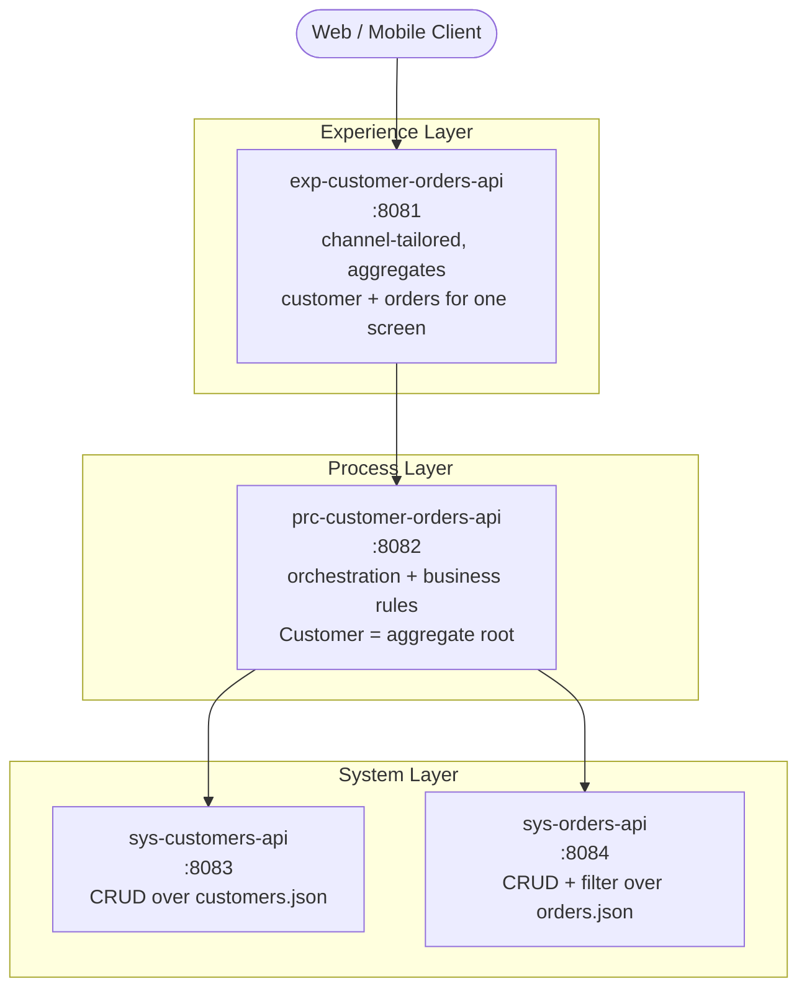

# API-Led Connectivity Network — Customers & Orders

## Context

We need a reference **API-led connectivity** network demonstrating the three canonical MuleSoft layers — **Experience → Process → System** — for a Customers + Orders domain. There is no database yet, so the System layer must mock and seed data but behave like a real system of record (mutations persist while the app runs). The working directory (`/Users/alexandra.martinez/Documents/GitHub/ai-showdown-2/claude`) is empty — this is a greenfield scaffold.

The deliverable is a full, runnable scaffold of **4 Mule applications** (one per API), each contract-first (RAML + APIkit), on the latest Mule/Maven/DataWeave, with seeded mock data, global error handling, and MUnit tests.

## Chosen Architecture (4 APIs)

I evaluated the two Process-layer options and chose **one combined Process API** because Order is a **sub-resource of Customer** (the aggregate root — every operation is "an order *attached to a customer*"). The only cross-entity rule (*delete a customer only if it has no orders*) lives naturally in one orchestrator, avoiding process-to-process chatter. The System layer is split **per entity** (systems-of-record boundary — canonical API-led practice: one System API per data entity/table). This yields exactly 4 APIs across 3 layers with no redundant CRUD.



**Why this is "API-led" and not one big API, nor over-split:**
- **System APIs** unlock each system of record independently and are pure, rule-free CRUD — reusable by any future process.
- **Process API** owns *all* business logic/orchestration (the delete-guard, cancel semantics, existence checks, customer+orders composition). No CRUD is reimplemented here — it delegates.
- **Experience API** adds channel concerns only (aggregation into one payload, correlation IDs, simplified DTOs). No business logic.

### Mock "database" decision

No Object Store, no real DB. **Each System API owns a JSON file that acts as its table** (`src/main/resources/data/customers.json`, `orders.json`), seeded with test data committed in the repo. On the first write the app copies the seed into a working file under a configurable data dir and thereafter **reads/writes that file** — so `create/edit/delete/cancel` genuinely persist across requests while the app runs, exactly like a DB, using only Mule-native File + DataWeave (no Java, no Object Store). Concurrency caveat (single-node, coarse file writes) is acceptable for a mock and will be noted in each System README.

## Endpoint Design

### System — `sys-customers-api` (base `/api`, port 8083) — rule-free CRUD
- `GET /customers` · `GET /customers/{customerId}` · `POST /customers` · `PUT /customers/{customerId}` · `DELETE /customers/{customerId}`

### System — `sys-orders-api` (base `/api`, port 8084) — rule-free CRUD + filter
- `GET /orders` (optional `?customerId=` filter — used by the process for the delete-guard and for "a customer's orders")
- `GET /orders/{orderId}` · `POST /orders` · `PUT /orders/{orderId}` · `DELETE /orders/{orderId}`

### Process — `prc-customer-orders-api` (base `/api`, port 8082) — orchestration + rules
Customer aggregate root with orders as sub-resource:
- `GET /customers` → list (delegates to sys-customers)
- `GET /customers/{customerId}` → details
- `POST /customers` · `PUT /customers/{customerId}`
- `DELETE /customers/{customerId}` → **RULE:** call `sys-orders GET /orders?customerId=`; if any exist → **409 Conflict**; else delegate delete
- `GET /customers/{customerId}/orders` → a customer's orders (sys-orders filter)
- `GET /customers/{customerId}/orders/{orderId}` → order details
- `POST /customers/{customerId}/orders` → **RULE:** verify customer exists (sys-customers) → create with `customerId` stamped
- `PUT /customers/{customerId}/orders/{orderId}` → edit (stays attached)
- `POST /customers/{customerId}/orders/{orderId}/cancel` → **RULE:** set `status = CANCELLED` (does NOT delete)
- `DELETE /customers/{customerId}/orders/{orderId}` → hard delete order

### Experience — `exp-customer-orders-api` (base `/api`, port 8081) — channel-tailored
Mirrors the process customer-centric tree for a web/mobile client, delegating to the Process API, plus channel value-add:
- `GET /customers/{customerId}` → **aggregates** customer profile + their orders into one payload (single mobile-screen call)
- All 11 operations exposed 1:1 for the client; adds `X-Correlation-Id` propagation and trims internal fields.

**All 11 required operations mapped:** list customers → `GET /customers`; one customer → `GET /customers/{id}`; a customer's orders → `GET /customers/{id}/orders`; one order → `GET /customers/{id}/orders/{orderId}`; create customer → `POST /customers`; edit customer → `PUT /customers/{id}`; delete-if-no-orders → `DELETE /customers/{id}` (409 guard); create order → `POST /customers/{id}/orders`; edit order → `PUT /customers/{id}/orders/{orderId}`; cancel order → `POST .../cancel`; delete order → `DELETE .../{orderId}`.

## Data Model (seed)

**Customer**: `id` (UUID), `firstName`, `lastName`, `email`, `phone`, `createdAt`.
**Order**: `id` (UUID), `customerId` (FK), `status` (`NEW|PAID|SHIPPED|CANCELLED`), `total`, `currency`, `items[]` (`sku`, `name`, `qty`, `price`), `createdAt`.
Seed ~4 customers; ~6 orders spread so at least one customer has **zero** orders (to demo a successful delete) and one has multiple (to demo the 409 guard and order sub-resource ops).

## Repository Layout

```
claude/
  README.md                      # network overview, run order, port map, curl walkthrough of all 11 ops
  pom.xml                        # (optional) aggregator/reactor pom building all 4 modules
  exp-customer-orders-api/
  prc-customer-orders-api/
  sys-customers-api/
  sys-orders-api/
```

Each module follows the standard Mule 4 Maven layout:
```
<app>/
  pom.xml
  mule-artifact.json
  src/main/mule/
    global.xml                   # HTTP listener config, APIkit config, HTTP request configs to downstream, global error handler
    <app>.xml                    # APIkit router main flow + one implementation flow per RAML action
  src/main/resources/
    api/<app>.raml               # RAML 1.0 contract + /examples + /dataTypes fragments
    config-<env>.yaml            # ports, downstream hosts/paths, data dir
    dwl/*.dwl                    # reusable transforms (e.g. buildCustomer.dwl, aggregateCustomerOrders.dwl)
    data/*.json                  # SYSTEM APIs ONLY — seed table
  src/test/munit/*-test.xml      # happy-path + key rule/error tests
  src/test/resources/...         # MUnit mocks/expected payloads
```

## Version Targets

Latest as of this plan (knowledge cutoff Jan 2026). External MuleSoft version pages are auth-gated, so **verify each against the MuleSoft repo at build time** and bump if newer:
- **Mule runtime** `4.9.x` (`minMuleVersion` 4.9.0) — Java **17** (already installed; confirmed `17.0.16`)
- **mule-maven-plugin** `4.3.0`
- **mule-apikit-module (APIkit)** `1.11.x`
- **mule-http-connector** `1.10.x`/`1.11.x`
- **DataWeave** `2.9` (ships with 4.9 runtime; `%dw 2.0` header)
- **MUnit** `3.x` (munit-maven-plugin + munit-runner/tools)

**Prerequisites to note in README:** Maven and (optionally) Anypoint/Mule CLI are **not** installed locally, and `~/.m2/settings.xml` has **no MuleSoft EE repo credentials**. Building/running needs: install Maven; add the `mulesoft-releases`/`anypoint-exchange-v3` repos + Nexus EE credentials to `settings.xml`; run with an EE runtime (or CE-compatible components only). This will be documented, not silently assumed.

## Cross-Cutting Concerns (applied to every app)

- **Contract-first**: RAML drives APIkit routing → auto 400 (bad body), 404 (unknown resource), 405, 406, 415.
- **Global error handler** per app mapping `APIKIT:*` and app errors to a consistent JSON error envelope `{ error: { code, message, correlationId } }` with proper HTTP status (incl. the process **409** for the delete-guard and **404** for missing customer/order).
- **Externalized config** via `config-*.yaml` + secure/property placeholders — ports and downstream URLs never hardcoded.
- **Correlation ID** propagated Experience→Process→System for traceability.
- **DRY**: shared transform logic factored into `dwl/*.dwl` fragments; RAML `dataTypes`/`examples` fragments reused across actions. No CRUD duplicated between layers.

## Build Order (dependencies bottom-up)

1. `sys-customers-api`, `sys-orders-api` (independent — build/run first)
2. `prc-customer-orders-api` (needs both System APIs up)
3. `exp-customer-orders-api` (needs Process API up)

## Verification

Because Maven isn't installed and EE-repo creds are absent, verification is staged:

1. **Static / structural** (works with no build): validate each RAML parses (RAML 1.0), confirm every RAML action has a matching APIkit implementation flow, and JSON seed files are well-formed (`python3 -m json.tool`).
2. **Unit** (once Maven + repo access exist): `mvn clean test` per module runs MUnit — asserts happy paths plus the key rules: delete-customer-with-orders → 409, delete-customer-without-orders → 204, create-order-for-missing-customer → 404, cancel sets `status=CANCELLED` and does **not** remove the order, and that a create followed by a get returns the new record (proves file-mock persistence).
3. **End-to-end** (once all 4 run locally): start apps in build order, then a scripted `curl` walkthrough (in README) exercising all 11 operations through the **Experience** API on :8081, e.g.:
   - `GET :8081/api/customers` → seeded list
   - `POST :8081/api/customers` → new id; `GET` it back
   - `POST :8081/api/customers/{id}/orders` → order attached; `GET :8081/api/customers/{id}/orders`
   - `POST .../orders/{orderId}/cancel` → order still present with `status=CANCELLED`
   - `DELETE :8081/api/customers/{withOrders}` → **409**; `DELETE :8081/api/customers/{noOrders}` → **204**

## Notes / Decisions Deferred to Implementation

- Aggregator reactor `pom.xml` at repo root is optional convenience; each module is independently buildable regardless.
- File-mock is single-node and not concurrency-hardened — documented as a mock limitation; swapping to a real DB later only touches the two System APIs (the whole point of the layering).
